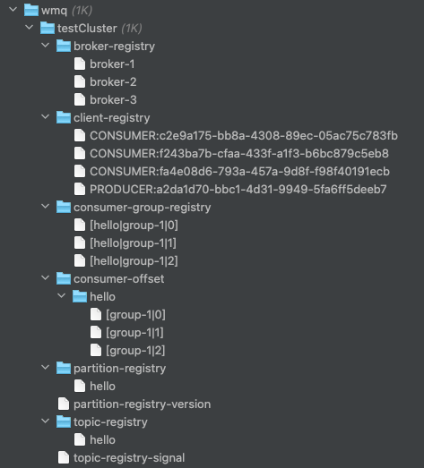

## 一、WMq是什么？

WMq是MQ消息中间件的一个最小实现，设计思想借鉴了Kafka+RocketMQ，本实现仅用作个人学习和交流，用于加深自己对于消息中间件系统的理解，**不建议用作生产环境 : )**

### 1. 核心角色

类似于Kafka，WMq有以下几大角色：

- **Zookeeper**：使用Zookeeper作为注册中心和协调中心，利用其CP特性实现节点状态统一，以及提供的watch机制触发集群状态变更
- **Broker**：核心角色，几大核心功能：对接Producer负责消息写入和存储，对接Consumer负责消息的读取。
- **Client**：有两个角色Producer和Consumer
  - **Producer**：消息生产者，通过Zookeeper连接Broker进行消息写入
  - **Consumer**（Group）：消息的消费者，通过Zookeeper连接Broker进行消息读取，使用**Pull模式**拉取消息
- **Admin**：提供基本的Dashboard和Topic的增（已实现）删改查，实际是对Zookeeper节点的增删改查


### 2. 核心概念

同样类似于Kafka，WMq定义了以下核心概念：

- **Cluster**：集群，用于环境隔离，体现在Zookeeper上就是`/wmq/clusterName`这个二级目录
- **Topic**：消息的主题，用于区分消息
- **Partition**：消息的分区，用于提升写入性能和消费性能，将同一个Topic的消息分散为多个Partition分区，在RocketMQ中是Queue的概念
- **Key**：一个消息，默认被随机分配给不同的Partition，如果想指定分配规则，可以使用Key+自定义PartitionRouter实现（一般用作顺序消费）
- **Uniq**：独创的概念，类似于RocketMQ的key，用作消息去重（基于短时间的时间窗口），比如10s内，只允许第一条带有相同Uniq的消息被发送
- **Replica**：消息的副本，用于提升高可用，在Broker中副本Follower和Leader错开部署，用于提升数据安全
- **Leader-Broker**：Leader-Follower是对应Partition而言的，一个Broker真多TopicA-Partition1可能是Leader，针对Partition2可能是Follower
- **Follower-Broker**：Follower不对Client服务，只是用于同步Leader的数据，并作为Leader的候选者
- **ISR**：为了保证消息的安全，不能随便选取Follower作为Leader，而是应该选举具备最高同步的Follower作为候选者，ISR就是这个最高同步着的集合
- **Offset**：偏移量，对于同一个Topic-Partition的消息，offset代表改消息在所有dbfile中的总偏移量
- **CommitLog**：原始日志文件，存在于在Broker宿主机的磁盘中
  - 文件目录格式：按/wmq/db/topic/partition/file的层次目录进行存储
  - 文件命名格式：第一个文件总是以`000000000.wmqdb`命名，9位命名支持的最大单个文件的大小是GB级别，第二个文件名是第一个大小，第三个文件是前两个文件的大小只和，依次类推
  - 用以上命名方式的好处在于，通过一个全局的offset，就能定位到是哪个文件（读和写皆可），提升了便利程度
- **Consumer-Group**：抽象出的Consumer往上的一层，用于更好的扩展Consumer消费，同一个Consumer-Group中可以有多个Consumer，这些Consumer分担所有的Partition。


最终的角色架构关系图如下：


## 二、QuickStart

### 1. 建议启动步骤

1. `git clone`本项目

2. 执行`mvn clean package -U`打包项目

3. 将对应的jar包拷贝至运行目录

4. 在任一目录下执行`java -jar `命令，运行不同的角色（**该目录将作为日志和DB文件的根目录**）

5. 启动顺序及命令建议如下：

   0. Zookeeper：自行启动，版本随意

   1. Broker：
      1. `java -jar -Xms256m -Xmx256m -Dserver.port=10201 -Dwmq.broker_brokerId=broker-1 -Dwmq.baseDir=wmq/db1 wmq-broker-exec.jar`
      2. `java -jar -Xms256m -Xmx256m -Dserver.port=10202 -Dwmq.broker_brokerId=broker-2 -Dwmq.baseDir=wmq/db2 wmq-broker-exec.jar`
      3. `java -jar -Xms256m -Xmx256m -Dserver.port=10203 -Dwmq.broker_brokerId=broker-3 -Dwmq.baseDir=wmq/db3 wmq-broker-exec.jar`
   2. Admin：
      1. `java -jar -Xms256m -Xmx256m  wmq-admin-exec.jar`
   3. Producer：
      1. `java -jar -Xms256m -Xmx256m wmq-producer-exec.jar`
   4. Consumer：
      1. `java -jar -Xms128m -Xmx128m  -Dserver.port=10401 wmq-consumer-exec.jar`
      2. `java -jar -Xms128m -Xmx128m  -Dserver.port=10402 wmq-consumer-exec.jar`
      3. `java -jar -Xms128m -Xmx128m  -Dserver.port=10403 wmq-consumer-exec.jar`

6. 访问admin接口进行操作

   1. MQ集群状态访问：`watch -n 1 curl "http://127.0.0.1:10100/wmq/admin/dashboard"`  每1s刷新一次
   2. 创建Topic：`curl "http://127.0.0.1:10100/wmq/admin/topic/create?topic=hello&partition=3&replica=2"`  定义名字为hello，副本2，分区3的topic
   3. 发送MQ：`curl "http://127.0.0.1:10500/wmq/producer/send?topic=hello&msg=nihao"` 单发消息
      1. 支持指定key用于分区，支持指定uniq用于时间窗口去重，皆可自实现逻辑
   4. 批量发送多条消息：`curl "http://127.0.0.1:10500/wmq/producer/stressTest?topic=hello&msg=a&times=2000"`  测试接口，用于压测和展示效果


### 2. 效果演示


## 三、核心原理

设计理念大部分借鉴于Kafka，关于Kafka的详细讲解可以参考[博文](https://www.cnblogs.com/makai/p/12720424.html)

### 1. Zookeeper目录结构

同早期Kafka版本一样，使用Zookeeper作为协调中心，记录持久化信息和监听变更事件。

```
WMq中zookeeper目录结构
/wmq
  |---clusterName：集群根目录
        |---topic-registry：Topic注册根目录
        			|---Topic-A：topic节点，记录name、parition、replica等元信息
        			|---...
        			
        |---topic-registry-signal：信号节点，用于Broker监听并进行partion分区处理
        
        |---broker-registry：Broker的注册目录
        			|---brokerId：记录broker基本信息，如host、port等信息，用于建立通信

        |---partition-registry：分区信息目录，
              |---Topic-A：节点以topic命名，记录的是分区对应的Leader和Followers
              |---Topic-B：
              |---...
              
        |---partition-registry-version：分区同步协调节点，用于协调多个Broker监听的先后
        
        |---client-registry：客户端注册根目录，注册Producer和Consumer
        			|---PRODUCER:UUID：记录的是Producer客户端的基本信息，host、port等，用于建立通信
        			|---CONSUMER:UUDD：记录的是Consumer客户端的基本信息，host、port等，用于建立通信
                
        |---consumer-offset：消费位点信息，用于记录消费的进度
              |---Topic-A
              			|---[|group|partition]：采用二元组命名，节点值为消费到的offset信息。【此为zk持久节点】
              |---Topic-B
              			|---[|group|partition]：采用二元组命名，节点值为消费到的offset信息。【此为zk持久节点】
              |---Topic-C
              			|---[|group|partition]：采用二元组命名，节点值为消费到的offset信息。【此为zk持久节点】
              
        |---consumer-group-registry：consumer客户端节点目录，用于控制topic-group-partition与客户端的1v1关系
              |---[topic|group|partition]：命名使用三元组，保证一个partition只有一个consumer消费，re-balance主要操作的就是这里
```


#### 截图示例




### 2.分区机制

分区的作用主要用于提升性能，便于水平扩展，每个Broker可以被划分为多个partition（partition>=1），每个Partition**一定**有**一个**Broker进行**读写**，有0-N个Broker进行备份。

partition可以在创建topic的时候指定，后期修改topic，分区数**只允许增加，不允许减少**

### 3. 数据存储和副本

WMq采用主动+被动两种方式触发消息的全量同步

#### 主动触发

当LeaderBroker写入完消息并达到阈值（topic维度，500条消息触发一次），则会通知对应partition的Followers进行全量拉取消息

#### 被动触发

每个Follower节点会有一个定时任务，每5s触发一次全量拉取

注意：

1. 为了保证线程安全，一个【topic-partition】维度的写入被设计为单线程执行，避免offset的混乱
2. 文件读取不涉及多线程操作，但是为了避免offset的反复横跳， dbReader被设计为按group区分，不同的group享有专用的文件句柄


结合replica和partition一条消息的流转过程大概为以下示意图：


### 4. partition重分配

broker通过监听zk的broker-registry节点，进行partition的重分配，每个partition保证必须有且仅有一个Leader，尽量做到均匀分配

broker在以下几个时间点进行re-partition

1. 节点启动时，如果partition没有主节点，则将自己置为主节点；否则将自己置入从节点中
2. broker-registry下为临时节点，当broker与zk心跳超时后，节点下线，其他节点监听后，会重新计算partition分配并进行**集群广播**

#### 4.1 ISR机制

ISR（In-Sync Replicas）机制的几个作用：

1. 快速选主
2. 保证最大化数据不丢失

本项目暂未实现ISR，但有一个大概的设计思路：

1. Follower对Leader进行全量同步，同步完成之后，发送Leader自己当前的offset
2. Leader维护一个ISR，ISR的结构为一个链表，链表长度可以配置，以3个节点为例
3. 节点按offset大到小排序 `Offset-Set<String>`，在2中，Follower发送offset加入到ISR中，由于Leader的offset不断变化，因此需要设置成链表的结构，链表越长，维护的ISR集合越多，链表越短，高QPS下可能会被覆盖导致无ISR集合信息
4. Leader周期性的广播自己的ISR到集群，集群中每个节点的ISR信息理论是一致的
5. ISR不放到Zookeeper之中，Zookeeper的强项是协调，而不是吞吐量
6. 当Follower进行主从切换时，将同步度最高的节点切换为主（链表头部）

### 5. re-balance

consumer实例在上下线的过程中，也会涉及到partition的重分配：

1. 节点上线时，会从所有消费者中挑选负载最终的进行消费转移
2. 节点下线时，其他consumer通过监听consumer-group-registry下线的节点，对没有消费的partition进行**抢占式消费**


### 6. 性能提升要点

本项目作为一个学习项目，只从功能上进行实现，对性能不做太高的要求。因此在吞吐量方面还有待提升，可以从以下节点进行考虑：

1. 序列化：本项目使用的Json+protobuff，有进一步优化空间
2. NIO：简单使用NIO，文件IO方面大有优化空间
3. 零拷贝（kafka使用的sendfile，rocketmq使用的mmap，总的来说sendfile性能更高也就导致kafka的吞吐量更好，rocketmq的功能更多）
4. 批量写、批量读（与一致性有点冲突，需要权衡）：
5. 异步刷盘+批次写入：本项目都使用的同步刷盘+单条消息写入，这一块优化空间巨大
6. 对象的精简、模块与对象的共用：需要进行针对性的优化
7. 数据结构和算法（数据量大的时候，低效算法耗时指数级上升）：这一块有少量优化空间 : )


